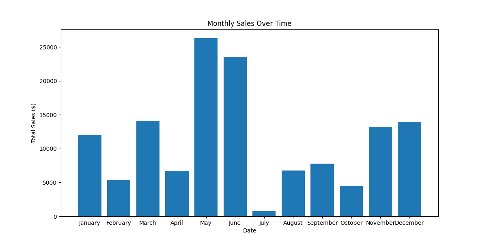
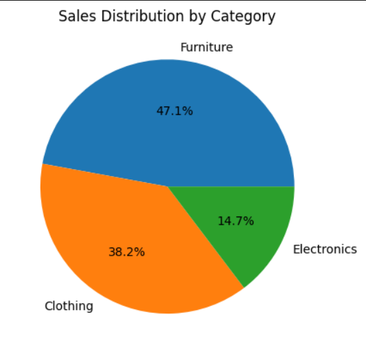
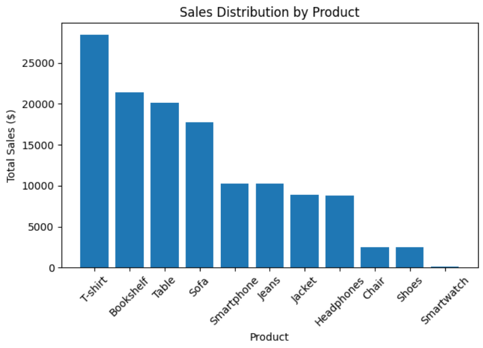
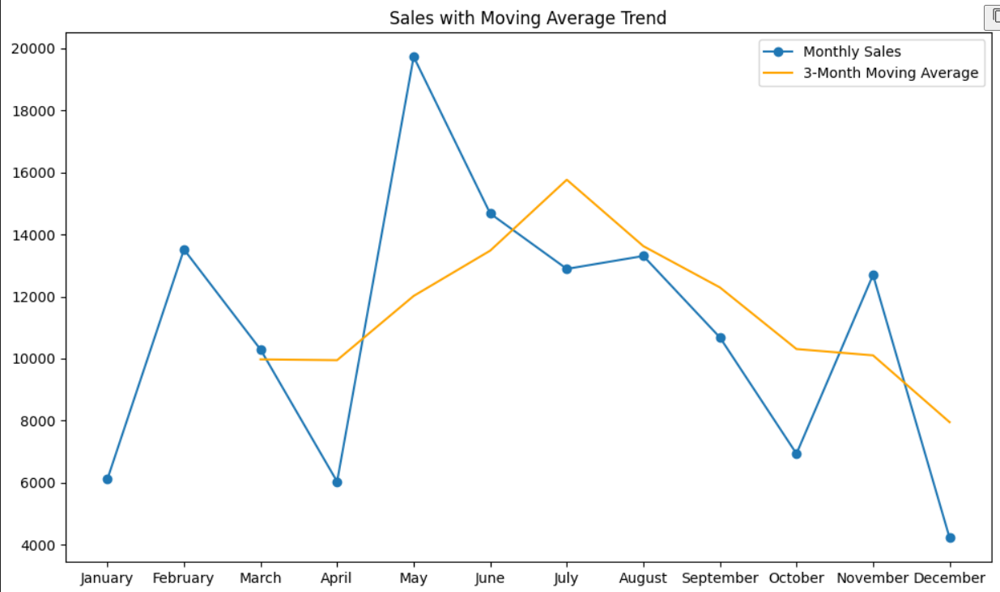

📊 Sales Data Analysis in Python

📌 Project Overview

This project analyzes sales data to uncover trends, identify top-performing products, and visualize sales performance over time.
Using **Python, Pandas, and Matplotlib**, the analysis focuses on monthly sales, category breakdown, product performance, and sales trends using moving averages.

 🛠 Tools & Libraries Used

* Python – Data analysis and scripting
* Pandas – Data cleaning & transformation
* Matplotlib – Data visualization
* Jupyter Notebook – Interactive analysis

 
📈 Key Visualizations

1️⃣ Monthly Sales Trend

Shows how sales vary month-by-month, highlighting peak and low-performing periods.

2️⃣ Sales by Category

Breaks down total sales by product category.

3️⃣ Sales by Product

Highlights top-performing products based on total sales.

4️⃣ Sales with Moving Average

Displays sales trend along with a 3-month moving average to smooth fluctuations.

🚀 Future Improvements

* Add predictive analysis using machine learning
* Automate data refresh from live sources
* Create interactive dashboards with Plotly / Power BI

📂 How to Run the Project

1. Clone this repository

2. Install dependencies

   pip install pandas matplotlib
   
3. Open the Jupyter Notebook
   
   jupyter notebook sales2.ipynb
   

💡 This project is part of my data analytics learning journey. Excited to explore predictive analytics next! 🚀

If you want, I can also **write you a short LinkedIn caption** that grabs attention and encourages people to check out your GitHub.
Do you want me to prepare that next?
